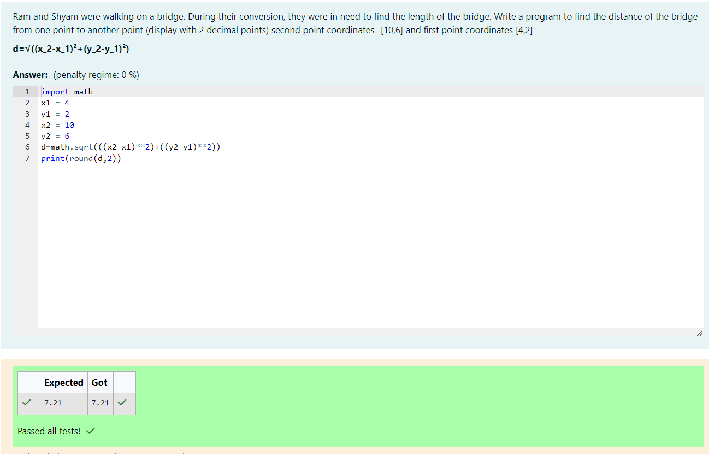

# DISTANCE-BETWEEN-TWO-POINTS
NAME : DEVA DHARSHINI I

REGISTER NUMBER : 212223240026

DEPARTMENT : AIML
## AIM:
To write a python program to find the distance two 2 points
## ALGORITHM:
### Step 1: 
Start.
### Step 2: 
Get the inputs from the user for the coordinates of the first point (x_1,x_2) and the second point (y_1,y_2).
### Step 3:
Substitute the values in the distance formula formula

  
### Step 4: 
Calculate the distance between the points and print the result.
### Step 5: 
End.
### PROGRAM:
```
#Program to find the distance between two points.
#Developed by: DEVA DHARSHINI I
#RegisterNumber: 212223240026
x_2=4
x_1=10
y_2=2
y_1=6
Distance=((x_2-x_1)**2+(y_2-y_1)**2)**0.5
print("{:.2f}".format(Distance))

```
### OUTPUT:



### RESULT:
The result is executed successfully.
